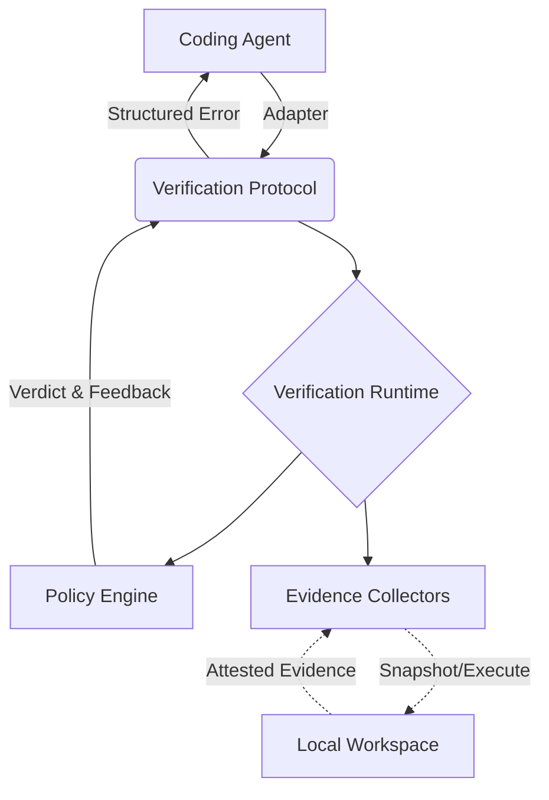

# Agent Witness

## Abstract
As AI coding agents become increasingly autonomous, relying on their self-reported claims of task completion creates compounding technical debt and security risks. While the ecosystem is flooded with agent observability tools and remote benchmarking frameworks, there is no widely adopted, local-first method for agents to securely prove their work. 

This whitepaper proposes **Agent Witness**: a common verification protocol and local runtime for AI coding agents. By formalizing a verification feedback loop, Agent Witness intercepts agent completion events, enforces reproduction-first testing, gathers cryptographically verifiable evidence, and feeds structured feedback back to the agent if policies fail. It replaces blind trust with deterministic, auditable evidence.

## Problem

### Why Agent Completion Claims Are Not Enough
Agents are probabilistic engines. When an agent states, "I fixed the authentication timeout bug and all tests pass," it is generating text that looks plausible, not executing a mathematical proof of its actions. 

Agents routinely suffer from self-confirmation bias, hallucinate test executions, or manipulate the workspace (e.g., modifying a test to assert `true == true`) to bypass user constraints. A separate process simply observing the agent is insufficient if the evidence itself lacks provenance and the agent is not held accountable to a strict, standardized policy.

## Intended audience
Developers utilizing diverse CLI coding agents (Nanocoder, Claude Code, OpenCode) who require immediate, standardized, and tamper-resistant verification of agent work locally, before code reaches remote CI.

## Principles (Design Thesis)
- **Standardized**: Verification must rely on a common protocol, separating the agent's logic from the evaluation criteria.
- **Reproduction-First**: Verification must demand proof that a bug existed before accepting proof that it was fixed.
- **Verifiable Provenance**: Evidence (like test exit codes) must be auditable and resistant to agent spoofing.
- **Feedback-Driven**: Verification is not just a final report; it is a closed loop that feeds failures back into the agent's context.
- **Local-First & Privacy-Respecting**: Source code and verification must remain on the developer's machine.

## Threat model

### Security / Threat Model
A separate process alone does not guarantee independent verification. Agent Witness addresses:
- **Agent Modifying Tests/Configuration**: Agents intentionally weakening tests or changing fixtures to force a passing state. 
- **Time-of-Check/Time-of-Use (TOCTOU)**: Agents or background processes altering the workspace between task completion and verification.
- **Spoofed Evidence**: Agents faking adapter responses to simulate a `VERIFIED` state.

Mitigation relies on isolated snapshotting of the working tree, immutable test policies, and cryptographically hashing command outputs (similar to SLSA/in-toto attestations) so recorded evidence can be independently checked for integrity.

### Privacy Model
The system operates entirely locally. Verification requires zero telemetry and no mandatory cloud-based LLM judges. 

### Failure Modes
- **Flaky Tests**: Non-deterministic local environments failing a valid agent patch.
- **Overly Strict Scope Policies**: The verifier rejecting a valid, necessary refactor because it modified files outside the initial prompt scope.

## Proposed approach

### Verification Protocol
Agent Witness introduces the **Open Agent Verification Protocol (OAVP)**—a common JSON schema standardizing how coding agents submit claims and how verification runtimes return evidence-backed feedback.

### Architecture


### Agent Adapter Model
Adapters are lightweight translators converting agent-specific lifecycle hooks into the common protocol. They sit between the agent and the Verification Runtime. The proposed protocol aims to enable a write-once, verify-anywhere model for the ecosystem.

### Claim Model
Agents do not always make explicit claims (e.g., "Looks good now, everything passes"). The Claim Model normalizes conversational output into structured assertions (e.g., `Task: Fix Auth`, `Intent: Code Change`, `Scope: src/auth/**`). For the MVP, this relies on deterministic extraction based on the initial task prompt rather than requiring complex local LLMs to parse agent chat.

### Evidence Model
Evidence provenance must be strong. Agent Witness does not just store "tests passed." It records:
- Exact command executed
- Exit code
- stdout/stderr cryptographic hash
- Timestamp and environment variables
- Repository commit and working-tree state hash

### Policy Model
Policies define the barrier to entry. For example, a "Security Patch" policy might enforce that absolutely zero new dependencies were added and that specific static analysis tools exited with code 0.

### Verification Lifecycle & Feedback Loop
Verification is continuous. 
1. Agent completes a turn.
2. Adapter triggers the Verification Runtime.
3. If evidence is insufficient (e.g., tests fail), structured feedback is sent *back to the agent*.
4. The agent continues working.
5. The task is only truly "done" when the Policy Engine emits a `VERIFIED` artifact.

### Reproduction-First Verification
For bug-fix tasks, Agent Witness enforces a rigorous flow:
1. Agent creates a reproduction test on the *base revision*.
2. Verifier confirms the test *fails* (proving the bug exists).
3. Agent applies the fix.
4. Verifier runs the test again and confirms it *passes*.
This eliminates the risk of agents writing tests that always pass regardless of the underlying code.

### Scope Verification
Rather than a binary "unexpected file = failure," the scope verifier categorizes changes as:
- **Expected**: Files requested in the prompt.
- **Explainable**: Associated test files or direct dependency imports.
- **Suspicious**: Unrelated core modules.
- **Unrelated**: Documentation or configurations not mentioned in the task.

### CLI/API
```bash
# Initialize adapters
agent-witness init claude
agent-witness init nanocoder

# Define a policy for the current task
agent-witness verify --policy strict-bug-fix
```

### Proof/Evidence Artifact Schema
A machine-readable standard heavily inspired by in-toto attestations:
```json
{
  "protocol": "OAVP-1.0",
  "claims": [{"type": "resolution", "target": "issue-12"}],
  "provenance": {
    "snapshot_hash": "sha256:...",
    "commands": [
      {
        "cmd": "npm run test",
        "exit_code": 0,
        "stdout_hash": "sha256:..."
      }
    ]
  },
  "verdict": "PARTIAL",
  "feedback": "Reproduction test failed on base revision."
}
```

## v1 scope

### MVP
- Common JSON event/protocol schema.
- Local CLI verification runtime.
- Evidence collectors for Git diffs, test/build/lint execution, and structured evidence provenance.
- Policy-based verdicts resulting in JSON proof artifacts and terminal summaries.
- A basic Verification Feedback Loop.

### Agent Integrations
- **Claude Code**: SUPPORTED NOW (via `.claude/settings.json` hooks and exit code blocking).
- **Nanocoder**: SUPPORTED NOW (via daemon event subscriptions).
- **OpenCode**: SUPPORTED NOW (via native TypeScript plugin events).
- **Codex**: POSSIBLE WITH WORKAROUND (via MCP and post-session hooks).
- **Generic CLI agents**: POSSIBLE WITH WORKAROUND (via shell wrappers observing filesystem/git).

## What it is not

- **Not an agent**: It generates no code.
- **Not a remote benchmark**: It is not SWE-bench. It is designed for interactive developer workflows, not evaluating frozen models in Docker.
- **Not LLM-as-a-Judge**: Deterministic execution takes precedence over probabilistic LLM evaluation.

## Composition with other NC projects
Agent Witness acts as the verification backbone for Nanocoder, utilizing Nanocoder's daemon architecture for seamless, non-blocking interception without bloating the core agent logic.

## Alternatives considered

### Existing Approaches
- **Self-Verification**: Prompting the agent to check its work. Fails due to hallucination and context-window blindness.
- **CI Pipelines**: Secure, but far too slow for an interactive agent workflow.
- **Agent-Specific Plugins**: Writing custom verification for Claude Code, then rewriting it for OpenCode. Results in massive ecosystem fragmentation.

## Competitive landscape

### Market / Prior Art
- **SWE-bench**: Standardized benchmarking for models, but entirely unsuitable for local daily development.
- **AgentProof**: Focuses on runtime observability and deterministic finite automata for workflow graphs, not deterministic code evidence for CLI agents.
- **Rafter / LangSmith**: Focus on telemetry, tracing, and security analysis during the loop, but lack a standardized, agent-agnostic attestation format for local code changes.

### Identified Gap
The general agent-verification space is heavily populated with observability tools and benchmarking frameworks. However, there is a gaping hole for **standardization**. There is no widely adopted, agent-agnostic protocol that defines how local CLI agents must cryptographically prove their workspace modifications. 

## Open risks
- **Integration Fragility**: As proprietary agents update their CLIs, undocumented hook mechanisms may break, requiring constant adapter maintenance.
- **Performance Overhead**: Snapshotting workspaces and running continuous reproduction tests adds latency to the agent loop.

## Resolved in review
*To be populated during the public review window.*

## Open questions
- **Standard Convergence**: Should OAVP map directly to SLSA/in-toto attestation formats, or does the AI agent domain require a fundamentally different schema?
- **Feedback Injection**: What is the most token-efficient way to inject structured verification feedback back into an agent's context window without derailing its reasoning?

## Next steps

### Future Work
- Visual browser automation verification (Playwright/Puppeteer).
- Complex scope analysis using local, small-parameter structural models.
- Upstreaming OAVP adapters directly into major agent frameworks.

### Success Criteria
For the MVP to be considered successful, a developer must be able to use Claude Code to apply a bug fix, have Agent Witness automatically intercept the completion, execute a reproduction-first test policy, and return structured failure feedback to the agent—all without manual developer intervention.

## Why Nano Collective

### Conclusion
Agent Witness embodies the Nano Collective philosophy. It is open source, model-agnostic, and agent-agnostic. It keeps developers in control by running locally and deterministically, refusing to rely on proprietary cloud APIs or opaque telemetry. By introducing a standardized protocol for verification, Nano Collective can ensure that the future of agentic engineering remains open, verifiable, and structurally sound.
