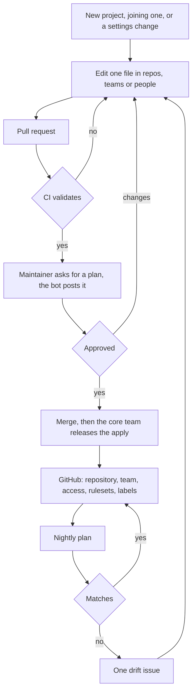

# Infrastructure as code

> **Decision, 5 October 2026: build approved.** The core team approved this
> proposal after discussion with the proposer, closing the review window early.
> Issues [#112](https://github.com/Nano-Collective/docs/issues/112),
> [#113](https://github.com/Nano-Collective/docs/issues/113) and
> [#114](https://github.com/Nano-Collective/docs/issues/114) remain open.

Adding a project to the collective means a sequence of GitHub administration.
Create the repository. Create a team. Grant that team access. Set the
description, homepage and topics. Turn on Dependabot alerts. Apply two
rulesets, each with six exactly spelled check names and the right bypass
actors. Add the labels.

All of it by hand, in a web interface, from memory. Nothing records that it was
done, and nothing notices when it stops being true.

This whitepaper proposes **holding that configuration as files in one
repository, applied by CI**. A project's GitHub setup becomes a file. Opening a
pull request shows exactly what would change; merging it applies that and
nothing else. GitHub first, with Cloudflare, npm and Discord to follow.

> **Note on scope.** This configures GitHub. It does not reach inside
> repositories: no workflows, no templates, no source files, no `CODEOWNERS`.
> Those belong to each project and to the shared workflows, and the boundary is
> deliberate rather than a staging decision.

## Problem

**The administration is manual and is not written down anywhere.** The launch
checklist in
[creating a new project](/collective/projects/creating-a-new-project) covers
what goes inside a repository. The steps that bring the repository into
existence, give it a team, and put the gates on it are not on any list. They
have only ever been clicks.

**The steps are individually easy and collectively unreliable.** Some have
stakes out of all proportion to how they look:

- The six required check contexts must read `pr-checks / Linting` and five like
  it. The bare job name matches nothing, and neither does the longer string the
  rulesets interface displays, which is a display label. One wrong character
  and the repository reports "6 of 6 required status checks are expected"
  forever, and nothing merges.
- The bypass actor for maintainers is role id 2. The ids are undocumented, are
  not ordered by privilege, and took a day of probing to establish.
- A ruleset with an empty bypass list blocks the scheduled jobs that push
  badges to their own repository, which then fail with no obvious connection to
  the ruleset somebody added that morning.

None of these are judgement calls. They are facts that should be written once
and applied everywhere, not rediscovered per repository.

**At fourteen repositories it has already stopped holding.** Read back from the
live API on 2 October 2026:

| | State today |
| --- | --- |
| Both rulesets applied | 7 of 14 repositories |
| One ruleset only | 2 (`contentforest`, `organisation`) |
| No rulesets at all | 5 (`docs`, `nanolist`, `roster`, `.github`, `taskforest`) |
| Automated code review in the ruleset | 6 of the 9 carrying Review gates |
| `core-team` can reach | 8 of 14 repositories |

Nobody decided that three repositories should skip automated code review and
six should have it, or that `core-team` should reach `nanocoder` but not
`docs`. That is residue, not a set of choices, and it arrived in under a year.

**There is nothing at the organisation level to fall back on.** The collective
is on GitHub Free, which has no organisation-wide rulesets, so the same
definition has to reach every repository one at a time. Doing that by hand is
what the five unprotected repositories record.

**And there is no one place to look.** Answering "who can merge to `sentinel`"
takes four pages of the GitHub interface.

## Intended audience

Maintainers and the core team, who will review these pull requests. Anyone
starting a project or joining one, who will write one. Anyone who wants to read
what the collective's access model actually is.

## Proposal

A public repository, `Nano-Collective/infrastructure`, holding one file per
repository, team and person, and an OpenTofu configuration that applies them.



Two humans stand between a file and GitHub, and both of them have read the
plan. Nothing else can write to the organisation.

### A project's GitHub configuration is one file

```yaml
name: my-project
description: One sentence saying what it does and who it is for.
visibility: public
topics: [cli, local-first]
vulnerability_alerts: true
rulesets:
  quality: { enforcement: evaluate }
  review:  { enforcement: evaluate, copilot_code_review: true }
manage_labels: true
maintainer_team: my-project-maintainers
whitepaper: my-project
```

Merging that creates the repository, creates the maintainer team, grants it
`maintain`, applies both rulesets with the six check names spelled correctly
and the right bypass actors, sets the labels and turns on alerts. Nobody has to
remember any of it, and nobody can get the check names wrong, because they are
written once in a module rather than typed into fourteen web forms.

Everything after that, the README, the tests, the workflow callers, the
templates, is the project's own business and is covered by the launch
checklist as it stands.

### CI applies it, and two people have read the plan

Validation runs on every pull request and holds no credentials, so a fork can
trigger it. A plan runs when somebody with write access asks for one, and posts
the exact set of changes as a comment. After the merge, the apply waits on an
environment where the core team are required reviewers.

One person approves having read the plan. A second releases it having read the
plan again. Nothing reaches GitHub that two people have not seen written out.

### Drift is reported, never corrected

A scheduled job runs a plan every night. When reality has moved it opens one
issue, updates it rather than opening another, and closes it when the
organisation matches again.

It does not put things back. Somebody changed that setting by hand and may have
had a reason, so the issue says what moved and a human decides whether the file
was wrong or the change was. A machine reverting a deliberate change at three
in the morning is worse than a drift report.

### Every project gets a maintainer team

This is the one rule that changes, and the part worth arguing about. Today
there is one team, and `core-team` holds `maintain` on eight of the fourteen
repositories.

The proposal is one `<project>-maintainers` team per project, holding
`maintain`. It is what makes "create a maintainer team" something a file can do
rather than something a person remembers, and joining a project becomes one
line in `people/`.

It widens who can merge, which is intended, and
[governance](/collective/organisation/governance) already says the core team's
tie-breaking role widens as the collective grows.

### Repositories cannot appear without an approved whitepaper

Every repository file names one. CI reads the live manifest at
`docs.nanocollective.org/whitepapers.json` and refuses the pull request unless
that whitepaper reads `Build approved`, which
[how a project comes to life](/collective/projects/how-a-project-comes-to-life)
requires and nothing has so far checked. It applies to the core team too. Three
exemptions exist, each named in the file: the fast path for small utilities,
infrastructure repositories, and projects that predate the pipeline.

### One repository, more services as they land

GitHub first, because it is where the work is and where the gaps are. The
Cloudflare Pages projects and the DNS for `nanocollective.org` are the same
shape with a second provider, then the npm organisation and Discord roles.

The point is one place for the collective's infrastructure, not one provider.

## What this is not

**It does not reach inside a repository.** No source, no workflows, no issue
templates, no `CODEOWNERS`. Two reasons. The first is a boundary: what a
project contains is the project's business, and the shared workflows already
cover the parts that should be the same everywhere. The second is mechanical: writing a file into a repository commits straight to the
default branch, which both rulesets block, so doing it would mean giving this
automation a bypass on the test gate. That is the break-glass path that becomes
a rubber stamp once it is routine.

**It does not hold secret values.** The catalogue lists which organisation
secrets must exist and CI fails when one goes missing, but no value enters the
repository or the state file.

**It does not replace Sentinel.** A plan is authoritative for anything in the
catalogue and can correct it. Sentinel audits what a catalogue cannot see, such
as whether a repository's tests would fail if the behaviour regressed. One asks
whether the configuration is right, the other whether the code is.

**It is not a bet on a licence the collective does not control.** The engine is
OpenTofu, MPL-2.0 under the Linux Foundation, rather than Terraform. The
configuration works with either, so this is reversible.

## The property v1 must have

**The first plan reports no changes.**

Recording what the organisation is, and changing what the organisation is, are
different pull requests. The catalogue was generated from the live API, drift
and all, and nothing was tidied on the way in. Until a plan says "no changes",
nothing is applied. This has been done: 62 resources imported, nothing added,
changed or destroyed.

Every repository also carries `prevent_destroy`, so removing one means deleting
its file and lifting that line in the same pull request, where a reviewer sees
both halves at once. A repository deleted by a typo is not coming back.

## Scope of v1

**In, all of it GitHub configuration:** repositories and their settings,
topics, features and alerts; both rulesets; labels, for repositories that opt
in; teams, their members, and which repositories they reach; organisation
membership and ownership; the whitepaper gate; nightly drift detection.

**Out, for now:** organisation settings, which the catalogue describes and CI
reads back but nothing applies, because the resource is all or nothing and
needs a billing email this repository should not hold. Cloudflare, npm and
Discord.

**Out permanently:** the contents of any repository, and secret values.

## What it costs

**The Free plan sets a floor.** Private repositories cannot carry a ruleset at
all: the API answers 403. `taskforest` is therefore unprotected and the schema
refuses to pretend otherwise.

**Maintainer teams widen merge rights.** That is intended, but it is a real
change and not a tidying-up exercise. If the collective does not want it,
everything else here works with `core-team` as the only team.

**Applying Review gates does not make Review gates mean anything.** It requires
a code-owner review, which is satisfied vacuously when a repository has no
`CODEOWNERS`, and four have none. That file is repository content and stays
outside this, so closing the gap is a pull request on each repository, opened
by a person. This proposal makes the gap visible rather than fixing it.

## Beyond v1

**The rest of the pipeline.** A build approval produces a pull request here,
opened by a bot, which a human reviews. Merging it provisions the GitHub side
of the project. That is the step the project pipeline already draws and nothing
performs.

**The other services.** Cloudflare Pages and DNS, then npm and Discord, so that
the collective's infrastructure is described in one place rather than five.

**Offboarding.** The collective documents sponsor offboarding in detail and
human offboarding not at all. Deleting a file is now the mechanism; what should
trigger it is a question this does not answer.

## Open questions

- Should the `admin` team exist? It grants access to nothing and duplicates
  organisation ownership.
- Should an organisation owner have to record why they are one? Three people
  can currently change anything, including the gates protecting this proposal's
  own repository.
- Is one maintainer team per project right, or one team per group of related
  projects?
- `CODEOWNERS` is deliberately outside this, but it is what makes a review gate
  real. Is a separate, smaller mechanism worth having, or does it stay a human
  job?

## Related

- [Project infrastructure](/collective/projects/project-infrastructure), whose
  rulesets this applies.
- [How a project comes to life](/collective/projects/how-a-project-comes-to-life),
  whose Stage 3 approval the whitepaper gate reads.
- [Creating a new project](/collective/projects/creating-a-new-project), which
  stays the guide to what goes inside a repository.
- [Sentinel](https://github.com/Nano-Collective/sentinel), for the other half of checking
  the collective's own infrastructure.
