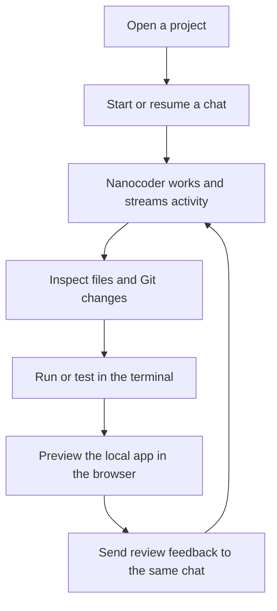
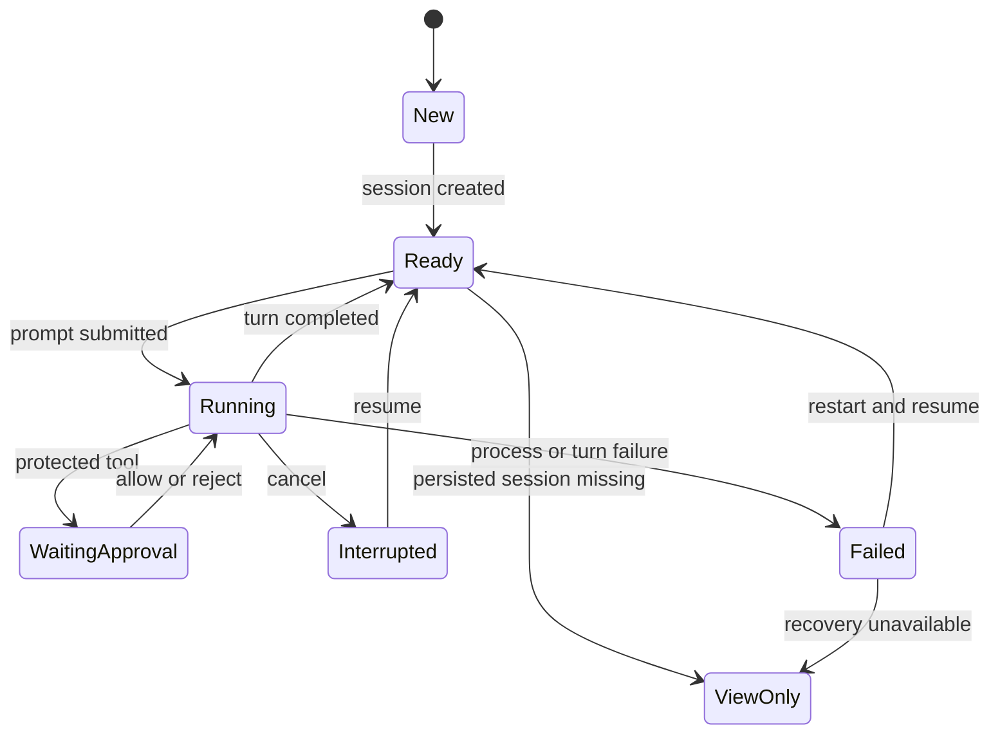
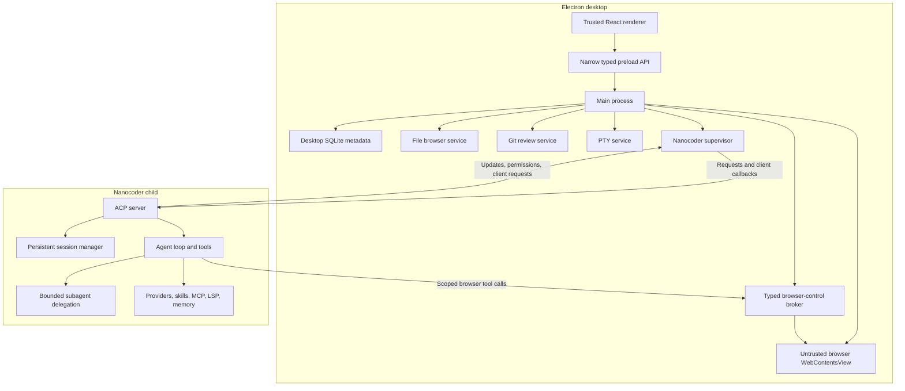
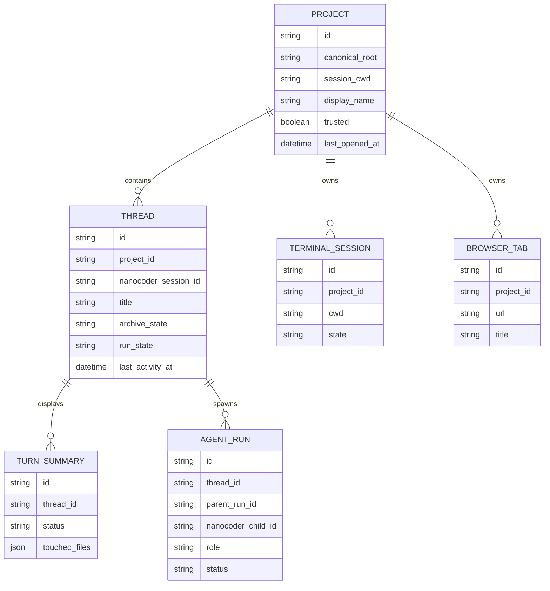
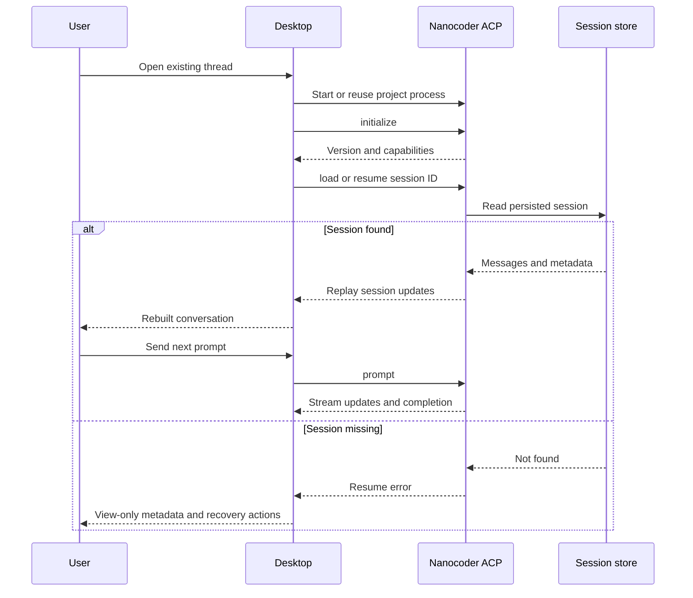
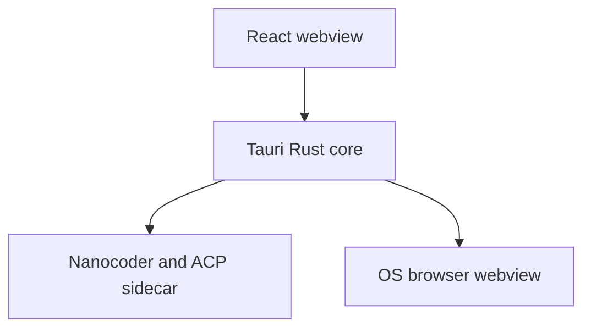
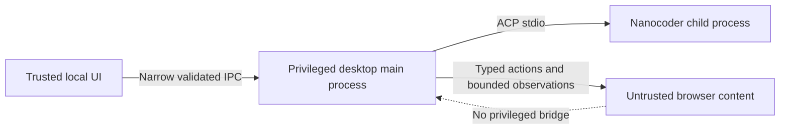

# Nanocoder Desktop

Nanocoder already has the agent. What it lacks is a focused desktop workspace
for returning to projects and chats, understanding what changed, inspecting
files, running a local project, and previewing the result.

This whitepaper proposes **Nanocoder Desktop**, a local-first application built
around Nanocoder's existing Agent Client Protocol server. It is inspired by the
project/thread/review loop documented for the OpenAI Codex desktop experience,
but it deliberately avoids reproducing the entire Codex product.

The first release combines durable chats, files, Git review, a terminal,
subagents, and an isolated agent-controlled browser. It does **not** add another
agent loop: Nanocoder continues to own models, prompts, tools, approvals, skills,
MCP, LSP, memory, and canonical conversation history.

## Problem

Nanocoder's terminal interface is effective for an active coding turn, but it
does not provide one persistent visual place to return to project chats, inspect
the repository, review its actual Git state, run the result, and preview a local
application. Editor integrations provide some of that experience, but they
require the user to adopt a particular editor.

The gap is not another agent. It is a small, standalone workspace around the
agent Nanocoder already ships.

### Product boundary

The product is a **desktop agent workspace**, not an IDE, cloud service, or
second implementation of Nanocoder. It includes bounded Nanocoder subagents and
control of its isolated browser, but not unrestricted OS-level Computer Use or
general-purpose multi-agent orchestration.

A thin chat window would not solve project navigation, review, or local
preview. A full IDE would repeat years of editor work and bury the agent
workflow under unrelated scope.

The intended loop is:

## Intended audience

Nanocoder Desktop is for developers who already use or want to use Nanocoder,
including CLI-oriented developers and general coders who want a visual,
project-oriented loop for longer tasks and review. It also serves designers,
product builders, and other technical users who find a CLI overwhelming but
still want to work with real repositories, local development servers, and
agent-assisted coding workflows. It is especially useful when the user wants
to keep their current editor and model provider.

It is not aimed at users seeking a full IDE, cloud-only execution, unrestricted
OS-level Computer Use, or a general desktop assistant.

## Principles

- **Privacy-respecting.** Provider credentials stay in Nanocoder's existing
  stores. The desktop does not introduce an account or cloud control plane.
- **Local-first.** Projects, Git state, terminals, browser sessions, and agent
  execution remain on the user's machine.
- **Open for all.** The application and its protocol integration should be open
  source, provider-neutral, and usable without a proprietary editor.
- **One agent source of truth.** Nanocoder owns prompts, providers, tools,
  approvals, sessions, skills, MCP, LSP, and memory.
- **Review reality, not claims.** The filesystem and Git are authoritative for
  files and diffs; agent events are attribution hints.
- **Least privilege at every boundary.** The renderer, ACP client callbacks,
  project services, terminal, and remote browser view receive only the access
  they need.
- **Small product scope, explicit future.** A focused v1 is preferable to a
  partial IDE or unreliable multi-agent system.

## v1 scope

### User experience

A user should be able to:

1. Add a project and start or resume its durable Nanocoder chats.
2. Follow streamed reasoning, messages, tools, diffs, and approvals.
3. Delegate bounded subtasks and follow each child agent.
4. Browse files, review the real Git worktree, and send observations to chat.
5. Run the project in an integrated terminal.
6. Let Nanocoder inspect and act inside an isolated browser, with approval for
   sensitive operations.
7. Relaunch the application and continue the same thread.

### Engineering requirements

- Reuse Nanocoder instead of forking its behavior.
- Keep provider credentials and configuration under Nanocoder's ownership.
- Use a versioned, capability-negotiated process boundary.
- Treat the filesystem and Git as authoritative for workspace state.
- Keep remote browser content isolated from desktop privileges and expose
  browser control only through a narrow, auditable tool boundary.
- Make process failure and unsupported capabilities visible.
- Remain viable on macOS, Windows, and Linux.

## What it is not (in v1)

- Unrestricted OS-level Computer Use, arbitrary CDP access, or browser control
  outside the dedicated app browser.
- Cloud execution or cross-device synchronization.
- Unbounded cross-project agent orchestration or autonomous scheduling.
- Git worktree creation and handoff.
- Automations and scheduled tasks.
- A skills or plugin marketplace.
- GitHub pull-request review integration.
- A full code editor, debugger, language-server UI, or source control client.
- Rich PDF, spreadsheet, presentation, image, or audio editing.
- Universal memory across unrelated chats.

These are exclusions, not architectural dead ends. The first release should
prove the project/chat/review loop before adding orchestration.

## User experience

### Main window

| Projects and threads | Active chat | Files and review |
|---|---|---|
| Fix login | User and agent messages | Repository tree |
| Add export | Reasoning and tool activity | Working-tree changes |
| Archived | Permission cards | File or unified diff preview |
| New chat | Composer | Touched-this-turn files |

The bottom panel switches between the project terminal and browser preview.

The panels may collapse, but the information architecture remains stable:

- **left:** projects and durable chats;
- **center:** the active conversation;
- **right:** files and review;
- **bottom:** terminal or browser preview with visible agent actions.

One active project, chat, preview, and terminal is enough for the first
release.

### Thread states

The UI distinguishes active, cancelled, failed, and view-only threads; archive
status remains separate UI metadata rather than a run-lifecycle state.

## Proposed approach

### Architecture

Use `nanocoder --acp` as a child process. Standard output is protocol-only;
standard error is kept in a bounded, redacted in-memory diagnostic ring. The
desktop sends ACP requests and simultaneously consumes notifications,
permission requests, client-side requests, and streamed updates.

The desktop starts a project-scoped browser-control adapter through Nanocoder's
existing MCP/custom-tool boundary. The adapter exposes typed operations such as
open, back, reload, wait, snapshot, screenshot, click, type, and scroll. It
does not expose arbitrary JavaScript, raw DevTools Protocol access, desktop IPC,
or filesystem access. The desktop advertises the browser capability only when
the adapter and browser surface are both ready; otherwise browser control is
unavailable rather than silently falling back to privileged IPC.

### Composition with Nanocoder

| Desktop | Nanocoder |
|---|---|
| Project roots and trust | Provider/model clients |
| Project/thread and subagent navigation | Prompt assembly |
| UI metadata and recent/archive state | Agent and tool loops |
| ACP process lifecycle | Tool registry and execution |
| Event, child-run, and turn-status rendering | Approval policy |
| File tree and file preview | Canonical session history |
| Git status and diff | Skills and custom tools |
| PTY terminal | MCP servers |
| Browser surface, browser-control adapter, and downloads | Subagent delegation and child sessions |
| Window and panel state | Semantic memory |
| Update and packaging UX | Timeline, retry, revert, artifacts |

This division preserves one source of truth for agent behavior while giving the
desktop enough responsibility to be useful.

### Why ACP

ACP already carries durable sessions, streamed messages and tool activity,
permissions, modes, models, commands, and file resources. The desktop must
negotiate capabilities rather than infer them from version alone; known protocol
quirks and extension methods are recorded in the supporting research.

ACP is bidirectional. In v1 the desktop exposes only bounded, project-root
validated file reads to Nanocoder—never filesystem writes or a terminal.

### Process policy

One supervised ACP process serves the selected project and its durable threads.
It runs one user-initiated root turn at a time while allowing bounded Nanocoder
subagents. The desktop shows their parent-child status and cancellation, resumes
persisted sessions after idle shutdown or failure, and applies depth/count
limits. Independent parallel root turns remain future work because model state
is currently process-scoped.

## Durable chats and data ownership

Nanocoder already writes canonical session files containing full message
history. The desktop stores a separate relational index for application state.

### Sources of truth

- **Nanocoder session file:** model conversation and continuation.
- **Filesystem:** current file contents.
- **Git repository/index:** change status and review.
- **Desktop database:** navigation, recent/archive state, touched-file summaries,
  subagent-run projections, and UI state.
- **Browser partition:** browser cookies, storage, cache, and history.

The desktop does not persist full ACP messages, file contents, tool results, or
stderr. Nanocoder replay remains authoritative for model continuation and chat
rendering.

### Resume sequence

Before release, test this flow with a real model-backed turn across a full
desktop and Nanocoder process restart.

### Project and session identity

Nanocoder's current session-list filter uses exact normalized working-directory
strings. Sessions started from a repository subdirectory, a symlinked path, or
a differently cased path may not be discovered under the desktop's canonical
project root.

The desktop stores both the canonical project root used for security and the
original session cwd used with ACP. Session listing is best-effort discovery;
the persisted Nanocoder session ID is the durable join key.

## File browser

The file browser is read-oriented. It helps the user understand and reference
the project without turning Nanocoder Desktop into an editor.

### Version 1

- lazy repository tree;
- Git-aware status badges;
- text/code preview with syntax highlighting and file-size limits;
- metadata for binary or unsupported files;
- refresh from file watching and manual reconciliation;
- "Open in editor";
- "Reveal in file manager";
- insertion of the selected file into the composer as an ACP resource.

All privileged file operations happen in the main process. It canonicalizes the
project root and requested path, resolves symlinks/junctions, blocks traversal
outside the root, and enforces entry/file/work limits. The renderer receives
file data, never a general filesystem capability.

Editing, rename/delete, project-wide content search, rich documents, and
multiple workspace roots are deferred.

## Git diff and review

Review must represent the repository, not only what the agent says it changed.

### Version 1

- changed-file list;
- staged and unstaged filters;
- unified text diff;
- binary, rename, add, and delete states;
- files touched by the latest Nanocoder turn;
- refresh from the real Git worktree and index;
- a selected line range and comment inserted transiently into the composer; and
- open the file in an external editor.

The Git service invokes the system Git executable with an argument array, no
shell interpolation, no pager, and no external diff driver. Status output uses
a NUL-delimited format.

### Honest last-turn labeling

If a file already contained user changes, a current Git diff cannot prove which
hunks Nanocoder added. The MVP labels **files touched in this turn** and shows
their current repository diff.

Exact "last-turn patch" attribution requires a baseline or checkpoint captured
before the turn. Staging, discarding, committing, branch comparison, GitHub
comments, worktrees, and merge/handoff flows are deferred. Read-only review
ships before destructive Git actions.

## Integrated terminal

One PTY terminal is tied to the selected project's canonical root.

Version 1 supports:

- start, stop, restart, and resize;
- the user's configured shell;
- interactive input;
- links to localhost URLs;
- explicit output clearing; and
- clean process-tree teardown.

The terminal is a **user terminal**, not an unreviewed execution path for the
agent. Nanocoder command tools continue to use Nanocoder's own approval policy.

Multiple terminal tabs, persisted scrollback, remote terminals, and automatic
server detection are later work.

## Agent-controlled browser

The browser is a user-visible, agent-controlled preview tool for inspecting a
running application or reference page. The user can navigate manually, or ask
Nanocoder to inspect the page and take bounded actions inside the dedicated
browser surface. The user remains able to pause, interrupt, or take control.

### Version 1 behavior

- open from a clicked chat/terminal URL or an address bar;
- back, forward, reload, and stop;
- support localhost by default and public HTTP(S) only after the user enables it
  in settings;
- show current origin and loading/security state;
- maintain a browser profile separate from the user's normal browser;
- visible downloads with destination confirmation;
- default-deny sensitive browser permissions;
- clear browser data from settings;
- open the current URL externally;
- send the current URL and title to the active chat;
- let the agent request typed navigation, waiting, page snapshots,
  screenshots, clicks, text entry, and scrolling; and
- show each agent action, observation, and pending approval in the chat and
  browser UI.

Annotations are a useful follow-up:

1. The user selects an element or rectangular region.
2. The app records the URL, viewport, selector or rectangle, and user comment.
3. The app sends that user-authored context to the active chat.

User-authored navigation and annotations remain available even when agent
control is disabled.

### Security boundary

The browser uses a dedicated Electron `WebContentsView` and persistent browser
partition, with Chromium sandboxing and no Node, preload, or direct desktop IPC.
The typed control adapter exposes bounded actions and observations, not arbitrary
JavaScript, raw CDP, filesystem, terminal, or file-upload access. Sensitive
submissions, purchases, permission changes, deletion, and downloads require
approval. Pages needing the user's regular profile open externally without
agent control. The complete rules appear in the threat model below.

## Alternatives considered

### Recommendation: Electron

Use Electron, React, TypeScript, the ACP SDK, SQLite, a supervised Nanocoder
child, system Git, a PTY, and an isolated `WebContentsView` connected through a
typed browser-control adapter.

Electron keeps Nanocoder integration and desktop services in one language,
provides consistent Chromium behavior, and offers the shortest contribution
path. This proposal prioritizes a working cross-platform product over the
smallest installer.

The cost is a larger distribution and a permanent Chromium security/update
obligation. Size should be measured, not defended with estimates.

### Alternative: Tauri v2

Tauri offers a smaller shell and a strong native capability boundary. Its costs
are a new Rust ACP client or TypeScript sidecar, two implementation languages,
and platform-specific WebView2/WKWebView/WebKitGTK browser behavior.

Choose Tauri if measured installer or memory targets become a release gate. Do
not choose it merely because "Tauri is lightweight."

### Rejected first-release alternatives

| Alternative | Decision |
|---|---|
| Local web application | Reject: privileged file/Git/PTY access and browser-within-browser make security and lifecycle worse. |
| Import Nanocoder internals into Electron main | Reject: internal TypeScript modules are not a stable product API. |
| Scrape or embed the Ink TUI | Reject: loses structured events and native approvals. |
| Legacy `--vscode` WebSocket | Reject: ACP is the maintained client boundary. |
| Build a new agent core | Reject: duplicates Nanocoder. |

## Distribution

### Prototype

Resolve a trusted Nanocoder package entry point, show its version/capabilities,
and preserve the user's provider configuration.

### Product release

Bundle a tested Nanocoder artifact and compatible Node runtime so the app and
agent protocol are reproducible. Keep an advanced external-CLI override for
contributors and testing.

Use a trusted absolute runtime and argument-array process launch; never rely on
shell interpolation or PATH-shadowable shims. A dedicated Node 22 sidecar is the
fallback if Electron's Node mode does not validate across all three platforms.

Nanocoder is MIT licensed. Distributions must retain its copyright/license and
complete third-party notices. Provider keys and OAuth credentials remain in
Nanocoder's existing stores and must never enter desktop logs.

## Threat model and security

The desktop combines three powerful local capabilities: filesystem access,
process execution, and rendering untrusted web content. The v1 threat model
therefore covers:

- a compromised renderer attempting to call privileged desktop APIs;
- repository paths, symlinks, or junctions escaping the trusted project root;
- an untrusted or PATH-shadowed Nanocoder executable;
- agent-initiated ACP file requests bypassing the file browser's checks;
- shell argument injection in Git or process launches;
- secrets appearing in transcripts, tool output, stderr, or crash reports; and
- remote pages requesting desktop privileges, popups, downloads, or external
  protocols; and
- prompt injection, sensitive-action abuse, or cross-origin confusion through
  agent-controlled browser content.

The model does not claim to protect against a compromised host operating
system, a malicious user who explicitly chooses an unsafe executable, provider
compromise, or a vulnerability in Chromium, Node, Electron, or Nanocoder. The
browser is agent-controlled only through the typed browser adapter. Page content
is untrusted input and must not grant the agent new desktop, filesystem,
terminal, or browser-origin privileges.

Required rules:

- sandbox renderers and validate every narrow IPC method;
- canonicalize every file/Git/ACP path and enforce root and size limits;
- launch only displayed, trusted absolute runtimes without shell interpolation;
- keep credentials and transcript/tool payloads out of desktop storage, telemetry,
  and crash logs; diagnostics stay bounded, redacted, and user-reviewed;
- show approvals for protected tools and sensitive browser actions;
- deny browser permissions, uploads, popups, and external protocols by default;
- treat page content as untrusted and confine actions to the active tab and
  approved origins; and
- ship signed updates and promptly apply Electron/Chromium security releases.

## Open risks

| Risk | Why it remains open |
|---|---|
| Durable ACP replay | Current source and tests persist and replay sessions, while checked-in Nanocoder documentation still says history is memory-only. A packaged, provider-backed restart test is required. |
| ACP capability accuracy | Nanocoder advertises `session/close` without implementing it, and vendor extension methods are not declared as capabilities. |
| Browser-tool integration | ACP has no standard browser-control capability at the inspected snapshot. The desktop must validate a supported MCP/custom-tool adapter before promising agent control. |
| Subagent event integration | Nanocoder's subagent tools and child-session events need a versioned desktop projection; the UI must degrade to ordinary tool cards when detailed child events are unavailable. |
| Session discovery | Current `session/list` filtering uses exact normalized cwd strings, so subdirectories, symlinks, case differences, and moved projects need explicit handling. |
| Process-global model state | Independent parallel root turns through one ACP process are unsafe until Nanocoder isolates model state by session. |
| Runtime packaging | Electron's Node mode may work, but a bundled Node 22 sidecar remains the predictable fallback until all three platforms are measured. |
| Git attribution | Git can show current changes but cannot assign overlapping pre-existing and agent edits to a turn without a baseline. |
| Browser control boundary | Agent-controlled public navigation expands the attack surface through prompt injection, sensitive actions, and cross-origin state; it remains disabled by default until the user enables it and each sensitive action is approved. |
| PTY portability | Shell discovery, process trees, signals, encoding, and Windows ConPTY behavior differ by platform. |

## Next steps

### Collective Stage 0 — raise the proposal

- Open a docs or organisation issue titled `Feedback for “Nanocoder Desktop”`.
- Confirm the proposer identity, intended repository, and v1 scope with the
  collective before opening the whitepaper PR.
- Copy the approved draft to
  `content/collective/whitepapers/nanocoder-desktop.md` in the docs repository.

### Technical gate — prove the boundary

Spawn the selected Nanocoder artifact with `--acp`, record capabilities, complete
a real turn, restart both processes, resume the session, and exercise both
approval paths. Exit when durable continuation works end to end.

### Milestone 1 — conversation workspace

Deliver trusted projects, durable threads, streaming and approvals, model/mode
controls, process errors, and bounded subagent run trees.

### Milestone 2 — files and review

Deliver the lazy file browser, preview/editor handoff, chat attachments, real
Git status/diffs, touched files, and transient review comments.

### Milestone 3 — run and preview

Deliver one PTY, localhost handling, the isolated agent-controlled browser,
browser data/download settings, and URL-to-chat context.

### Milestone 4 — hardening

Validate packaging, path security, ACP compatibility, crash recovery, browser
security, large-project performance, accessibility, and keyboard navigation on
macOS, Windows, and Linux.

### Later, only after evidence

- multiple terminals;
- full-text thread and filename search;
- exact per-turn patch attribution;
- stage/commit/branch actions;
- worktrees and independent parallel root agents;
- richer file previews;
- skills/configuration management UI; and
- remote execution.

## v1 success picture

The first release succeeds when a user can:

1. Install and launch the app on each supported operating system.
2. Open a real repository.
3. Start a Nanocoder chat and see structured streaming/tool activity.
4. Approve or reject a protected operation.
5. Delegate a bounded subtask, observe the child run, and stop it when needed.
6. Close and relaunch everything, then continue the same chat with its model
   context intact.
7. Browse and preview project files safely.
8. Review the repository's actual Git diff.
9. Send a file or review comment into the active chat.
10. Start a development server in the terminal.
11. Ask the agent to inspect and interact with it in an isolated in-app browser,
    while keeping the page away from desktop privileges.

The release must not duplicate provider credentials, agent prompts, tool
policy, skills, MCP, LSP, or semantic memory.

## Open questions

1. Does the first public release require a user-installed Nanocoder, or ship a
   bundled tested version?
2. Which Nanocoder versions and ACP capabilities are supported?
3. Which subagent event, child-session, cancellation, and approval surfaces can
   be supported without Nanocoder-specific version coupling?
4. Is SQLite acceptable as a new desktop dependency and migration surface?
5. Which code/diff and PTY libraries meet license and platform requirements?
6. Should browser state be one app-wide profile or one profile per project?
7. Which external editors receive first-class "Open in editor" support?
8. When should full-text chat/file search become worth its index and retention
   surface?
9. Should the desktop begin as a separate repository or a Nanocoder workspace
    package?

## References

- [Nanocoder source at the inspected commit](https://github.com/Nano-Collective/nanocoder/tree/dc8e121a0c4e6963df7447b9ae68491ec993679b)
- [Nanocoder ACP agent and session implementation](https://github.com/Nano-Collective/nanocoder/blob/dc8e121a0c4e6963df7447b9ae68491ec993679b/source/acp/acp-agent.ts)
- [Nanocoder session storage](https://github.com/Nano-Collective/nanocoder/blob/dc8e121a0c4e6963df7447b9ae68491ec993679b/source/session/session-manager.ts)
- [Nanocoder ACP capabilities](https://github.com/Nano-Collective/nanocoder/blob/dc8e121a0c4e6963df7447b9ae68491ec993679b/source/acp/acp-capabilities.ts)
- [OpenAI: Introducing the Codex app](https://openai.com/index/introducing-the-codex-app/)
- [OpenAI Codex app-server](https://developers.openai.com/codex/app-server)
- [OpenAI in-app browser](https://developers.openai.com/codex/app/browser)
- [Electron `WebContentsView`](https://www.electronjs.org/docs/latest/api/web-contents-view)
- [Electron security guidance](https://www.electronjs.org/docs/latest/tutorial/security)
- [Tauri webview API](https://v2.tauri.app/reference/javascript/api/namespacewebview/)

The expanded evidence ledger and source analysis are retained alongside this
working draft in `codex-inspired-nanocoder-desktop-research.md`.
